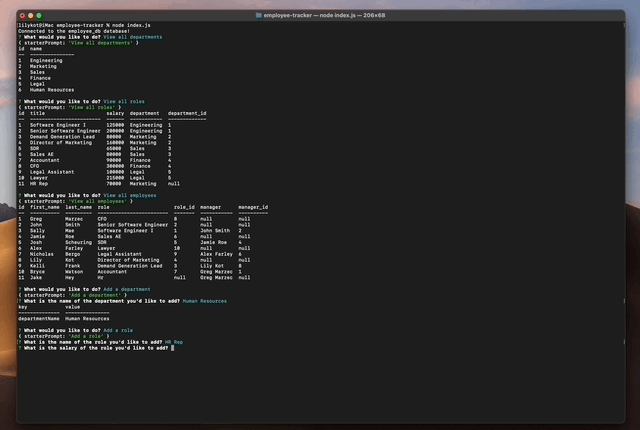

# Employee Tracker

## Project Description

This project entailed creating a command-line application that allows a user to manage a company's employee database, using Node.js, Inquirer, and MySQL.

## Table of Contents

- [Languages and Technology Used](#languages-and-technology-used)
- [Project Demonstration](#project-demonstration)
- [Code Snippet](#code-snippet)
- [Author Links](#author-links)

## Languages and Technology Used

- JavaScript
- SQL

## Project Demonstration



## Code Snippet

The code below is used to add a new department to the table of current departments in the database. If a user selects "Add a department" from the initial list of prompted questions, they are then shown a question requiring the department name. The new department is then inserted into the exisiting table of departments.

```
else if (answers.starterPrompt === "Add a department") {
        inquirer.prompt(addDepartment).then(function (data) {
          console.table(data);
          db.query(
            `INSERT INTO department (name) VALUES("${data.departmentName}");`,
            (err, results) => {
              if (err) {
                throw err;
              }
            }
```

## Author Links

- [GitHub](https://github.com/lilyannekot)
- [LinkedIn](https://www.linkedin.com/in/lilykot/)
